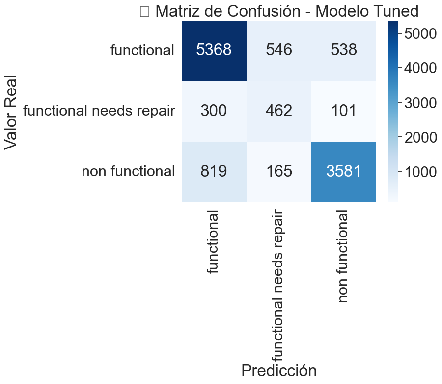

# Predicción del Estado de Bombas de Agua en Tanzania

Este proyecto aborda el reto de predecir el estado operativo de bombas de agua en Tanzania (funcional, necesita reparación, no funcional), utilizando datos abiertos de DrivenData. Mejorar la eficiencia en el mantenimiento de estas bombas es crucial para garantizar el acceso al agua potable en zonas rurales.

Durante el desarrollo se identificaron desafíos significativos:
- Datos incompletos y registros inválidos: alrededor del 40% de los registros presentaban valores nulos o inconsistentes en variables clave como `construction_year` y `gps_height`.
- Variables categóricas de alta cardinalidad.
- Distribución desbalanceada entre clases.

Para resolverlos se implementaron:
- Limpieza de datos eliminando outliers y tratamiento riguroso de valores nulos.
- Ingeniería de características para optimizar variables categóricas y crear nuevas variables geográficas.
- Selección de variables predictivas y modelado con Random Forest, validando mediante F1-macro score.

## Resultados
- **F1-macro score en DrivenData**: 0.8020
- **Principales variables predictivas**: `quantity`, `gps_height`, `longitude`, `population`



## Cómo usar
1. Clonar este repositorio:
    ```bash
    git clone https://github.com/tu-usuario/water-pump-prediction.git
    cd water-pump-prediction
    ```
2. Instalar dependencias:
    ```bash
    pip install -r requirements.txt
    ```
3. Ejecutar el notebook:
    - Navegar a la carpeta `notebooks/`
    - Abrir y ejecutar `pump_it_up_water_table_prediction.ipynb`

## Dataset
- Fuente: [DrivenData - Pump it Up Challenge](https://www.drivendata.org/competitions/7/)

## Tecnologías
- Python
- Pandas, NumPy
- Scikit-learn
- Matplotlib, Seaborn
- Geopy, Plotly

## Autor
David Fernando Echeverría

## Licencia
Este proyecto está licenciado bajo los términos de la licencia MIT.